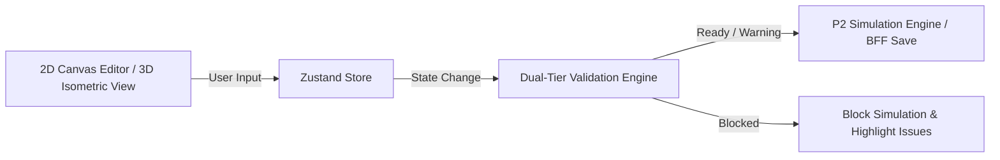

# AGENTS.md — วางร้าน (Wang-Raan) & Harness Operating System

> ไฟล์นี้เป็น context และระเบียบปฏิบัติหลักสำหรับ AI Agent ในการทำงานกับโปรเจกต์ **วางร้าน (Wang-Raan)**
> ตอบเป็นภาษาไทย เว้นแต่ผู้ใช้จะระบุขอเป็นภาษาอื่น

---

## Startup Workflow & Harness Setup

ก่อนเขียนโค้ดหรือแก้ไขไฟล์ใด ๆ ในแต่ละเทิร์น:
1. **ยืนยัน working directory** ด้วย `pwd` (ต้องอยู่ที่ root ของ repo `wang-raan`)
2. **อ่านไฟล์นี้ (`AGENTS.md`)** ให้เข้าใจขอบเขตและกฎสำคัญ
3. **อ่าน context หลักของระบบ**:
   - `PRD.md` — ฟังก์ชัน, โมเดลข้อมูล, กฎระยะ Clearance, และวงจรชีวิตเก้าอี้-โต๊ะ
   - `architecture.md` — สถาปัตยกรรม Next.js App Router, BFF, Dual-Tier Validation, Hybrid DOM+SVG, และ Web Worker
   - `design-system.md` — โทเคน CSS Variables, ธีมสี, ฟอนต์, สถานะ Ready/Warning/Blocked, และ Issue Rings
   - `SKILL.md` — กฎเหล็ก 9 ข้อ และเช็กลิสต์การส่งมอบงาน
4. **รัน `./harness/init.sh`** เพื่อตรวจว่า workspace, dependencies และ Architectural Boundaries พร้อม
5. **อ่าน `harness/feature_list.json`** เพื่อเลือกงานที่ active และดู dependencies / gates / priorities
6. **อ่าน `harness/progress.md`** เพื่อดูงานที่ทำเสร็จแล้ว งานค้าง และบันทึกจากเซสชันก่อนหน้า

---

## Working Rules (Harness Workflow)

- **One Feature at a Time**: เลือกงานที่มี `"status": "not-started"` หรือ `"in-progress"` ใน `harness/feature_list.json` ที่ไม่มี dependency ค้างอยู่ ครั้งละ 1 งานเท่านั้น
- **Gate ต้องผ่านก่อน**: งานที่มีเงื่อนไข `gate` ต้องผ่านเกณฑ์ก่อนเริ่มงานเสมอ
- **Task Decomposition**: ทุกงานที่มีความซับซ้อน (>3 steps หรือเป็นเรื่อง geometry/math/validation logic) ต้องเขียนแผนในบทสนทนาก่อนลงมือเสมอ:
  ```
  GOAL: <เป้าหมายที่แท้จริงของงานนี้>
  DONE-WHEN: <เกณฑ์เสร็จสมบูรณ์ที่ตรวจสอบได้จริงเป็นรูปธรรม 2-5 ข้อ>
  PLAN:
    1. <ขั้นตอนการทำงาน> — verify โดย: <จะรู้ได้อย่างไรว่าขั้นตอนนี้ผ่าน>
  RISKS: <จุดที่อาจผิดพลาดได้ง่าย หรือเคสที่อาจพัง>
  ```
- **Stay in Scope**: แก้เฉพาะไฟล์ที่เกี่ยวข้องกับขอบเขตงานที่กำลังทำ ห้ามแตะไฟล์นอกเรื่อง
- **Verification Gate**: ต้อง verify ด้วย `make test` หรือ `npm test` และตรวจสอบ boundary checks ให้ผ่าน 100% ก่อนอ้างว่างานเสร็จ
- **State Updates**: เมื่องานเสร็จ ให้อัปเดต status ใน `harness/feature_list.json` เป็น `"done"` พร้อมใส่ `"evidence"` และบันทึกสรุปงานลง `harness/progress.md` ตามรูปแบบที่กำหนด
- **Session Lifecycle**: ก่อนจบเทิร์นหรือส่งต่องาน ต้องอัปเดต `harness/session-handoff.md` เสมอ

---

## ภาพรวมระบบ (System Overview)

**วางร้าน (Wang-Raan)** คือ Web Application สำหรับออกแบบผังร้านอาหาร/คาเฟ่ในระบบ 2D/3D และจำลองการสัญจรของลูกค้า (Customer Flow Simulation) 

แนวคิดหลัก: **"จัดร้านก่อน แล้วค่อยจำลองลูกค้า"**



---

## หลักการสำคัญ (อย่าละเมิด — Inviolable Principles)

| หลักการ | รายละเอียดที่ห้ามละเมิด |
|---|---|
| **Core Validation ต้องเป็น Pure TS** | โค้ดใน `src/core/validation/` ต้องเป็น Pure TypeScript 100% — **ห้าม import React, ReactDOM, Zustand, หรือ DOM APIs** เพื่อให้รันได้ทั้งบน Client, BFF และ Web Worker |
| **ห้ามใช้ Three.js / WebGL** | 2D Canvas ใช้ **Hybrid DOM (% CSS) + SVG** และ 3D View ใช้ **Pure SVG Isometric Projection** เท่านั้นเพื่อความเร็วและเบา |
| **Table Set Lifecycle ต้องสมบูรณ์** | เก้าอี้ลูกต้องสังกัดโต๊ะ (`tableId`), การย้าย/หมุนโต๊ะเก้าอี้ต้องไปตามกันทั้งชุด, การลบโต๊ะต้องทำ **Cascade Delete** เก้าอี้ลูกทั้งหมด (ห้ามเกิด Orphan Chair) |
| **P2 Validation Gate ต้องเข้มงวด** | หากผังขึ้นสถานะ **Blocked** ปุ่ม "เริ่มจำลอง (Simulation)" ต้องถูก Disabled ทันที จะกดได้เมื่อผังเป็น **Ready** หรือ **Warning** เท่านั้น |
| **Snap Grid 0.25 เมตร** | ทุกพิกัดเรขาคณิตต้อง Snap เข้า Grid ละ 0.25 ม. (ขนาดร้านรองรับ 2–30 ม.) |
| **ระยะ Clearance มาตรฐาน V1** | ทางเดินหลัก ≥ `1.20 ม.`, ทางเดินรอง ≥ `0.90 ม.`, ทางเข้าถึงเก้าอี้ ≥ `0.60 ม.`, เก้าอี้สอดใต้โต๊ะได้ไม่เกิน `0.10 ม.` |
| **Desktop-First 6 Breakpoints** | รองรับความกว้างหน้าจอ `320px`, `375px`, `480px`, `768px`, `1024px`, `1440px` โดย **ห้ามมี Horizontal Scrollbar เด็ดขาด** |
| **WCAG 2.1 AA Accessibility** | รองรับคีย์บอร์ด Tab ทั่วถึง, แสดง Focus Ring ชัดเจน (`outline: 3px solid #a4b6ff`), มี `aria-label` ภาษาไทย และเคารพ `prefers-reduced-motion` |

---

## สถาปัตยกรรม (Architecture Layers)

### 1. Presentation Tier (Client)
- **App Router:** `app/(marketing)/page.tsx` สำหรับ Landing Page และ `app/(app)/playground/page.tsx` สำหรับ Editor
- **Styling:** Tailwind CSS v4 ร่วมกับ CSS Variables โทเคนใน `design-system.md`
- **Editor Canvas:** Hybrid DOM (% CSS) ร่วมกับ SVG Linear Gradient สำหรับ Grid
- **3D Isometric View:** Pure SVG Isometric Projection คำนวณแกน x, y, z

### 2. Client State & Core Logic Tier
- **Store:** Zustand (`src/store/use-layout-store.ts`) รองรับ History Undo/Redo 40 ขั้น
- **Core Domain:** Pure TypeScript (`src/core/`) จัดการ Entities, Table-Chair Relations, Geometry
- **Validation Engine:** Pure TypeScript (`src/core/validation/`) ตรวจ 4 ด้าน: Completeness, Collision, Clearance, Accessibility

### 3. Backend-for-Frontend (BFF) Tier
- **Route Handlers:** `app/api/layouts/route.ts` รับ Request, ตรวจสอบ Schema ด้วย Zod, Re-validate ผังร้านซ้ำก่อนบันทึก
- **Session Relay:** ตรวจสอบ Session ด้วย NextAuth / Auth.js v5

### 4. P2 Simulation Tier
- **Web Worker:** รัน Pathfinding บน Worker Thread แยก
- **Grid:** แปลงผังร้านเป็น Occupancy Grid ความละเอียด 0.25 ม.
- **Simulation Overlay:** Canvas Layer ทับบน Artboard แสดงจุดลูกค้าและ Heatmap

---

## โครงสร้างไฟล์ของโปรเจกต์

```
wang-raan/
├── harness/                    # ← Agent Harness Ecosystem
│   ├── init.sh                 # Environment initialization & boundary check
│   ├── feature_list.json       # Master feature task tracking (Single source of truth)
│   ├── feature_list.archive.json # Archive ของ feature ที่เสร็จสิ้น
│   ├── progress.md             # Worklog บันทึกความคืบหน้าของแต่ละ session
│   ├── session-handoff.md      # เอกสารส่งต่องานระหว่างเซสชัน
│   └── archive/                # เอกสารเก่าที่ archive ไว้
├── scripts/                    # ← เครื่องมือสนับสนุน Harness
│   ├── harness_state.py        # ตัวโหลด state และ merge archive
│   └── validate_harness.py     # ตัวตรวจจับ Schema, Broken/Cyclic Deps
├── src/
│   ├── core/                   # ← Pure TypeScript Core Domain (ห้าม import React/DOM)
│   │   ├── types/              # Geometry, Entity, Layout schemas
│   │   ├── geometry/           # Grid snap 0.25m, polygon math, service points
│   │   ├── entities/           # Table-chair lifecycle, cascade delete
│   │   └── validation/         # Dual-tier validation engine (4 pillars)
│   ├── store/                  # Zustand Store & Undo/Redo history
│   ├── components/             # React UI Components (Shadcn + Radix)
│   │   ├── editor/             # 2D Hybrid DOM Canvas & 3D Isometric View
│   │   ├── ui/                 # UI Primitives
│   │   └── simulation/         # Canvas overlay & Heatmap
│   └── workers/                # Web Worker สำหรับ P2 Flow-field simulation
├── app/                        # Next.js 15 App Router
│   ├── (marketing)/            # Landing page
│   ├── (app)/                  # Editor workspace (/playground)
│   └── api/                    # BFF Route Handlers (/api/layouts)
├── design-html/                # Prototype ต้นแบบ (HTML/CSS/Assets)
├── Makefile                    # รวมคำสั่งลัดประจำโปรเจกต์
├── PRD.md                      # Product Requirements Document
├── architecture.md             # System Architecture Document
├── design-system.md            # Design Tokens & UI Guidelines
├── SKILL.md                    # Core Developer Rules & Checklist
└── AGENTS.md                   # คู่มือปฏิบัติการของ Agent (ไฟล์นี้)
```

---

## คำสั่งประจำ (Makefile Commands)

```bash
make help        # แสดงคำสั่งทั้งหมด
make init        # รัน ./harness/init.sh ตรวจสอบระบบและ boundaries
make status      # ตรวจสอบความถูกต้องของ Harness Tasks
make test        # รัน Unit Tests ทั้งหมด
make lint        # ตรวจสอบ linting และ boundary checks
make dev         # เริ่ม Next.js Development Server
```
