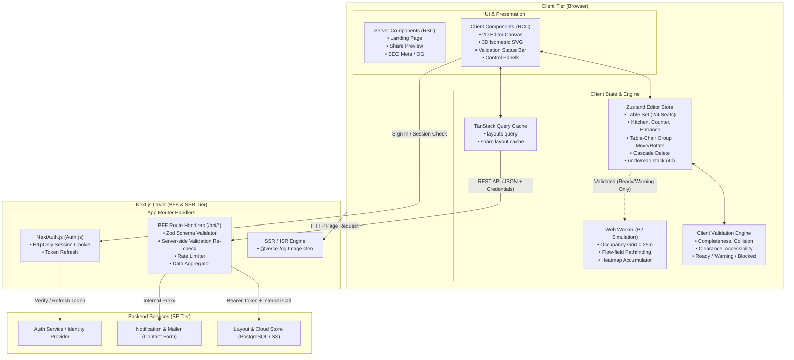
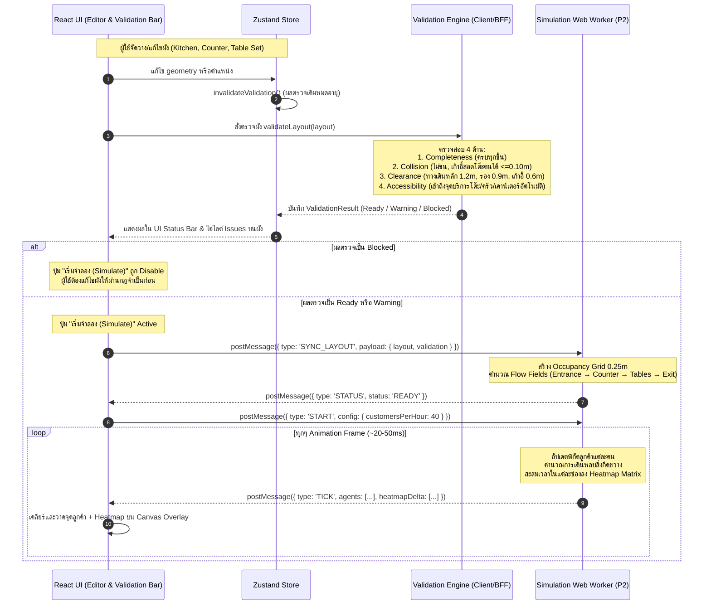

# วางร้าน — Frontend Architecture (Next.js + BFF)

อัปเดต: 9 ตุลาคม 2026 · สถานะ: Approved Architecture v2.0  
เอกสารที่เกี่ยวข้อง: [PRD.md](PRD.md) · [design-system.md](design-system.md) · [SKILL.md](SKILL.md)

---

## 1. บทสรุปสถาปัตยกรรม (Architecture Executive Summary)

สถาปัตยกรรม Frontend ของ **วางร้าน (Wang-Raan)** พัฒนาด้วย **Next.js (App Router)** โดยนำแนวคิด **BFF (Backend-for-Frontend)** มาใช้เป็นตัวกลางในการจัดการ Session, ตรวจสอบข้อมูล (Validation) และรวมการเรียก API ไปยัง Backend Services 

เพื่อคงหัวใจสำคัญของผลิตภัณฑ์คือ **"จัดร้านง่าย โหลดเร็ว คมชัดทุกขนาดหน้าจอ และเข้าถึงได้ทุกคน (Accessibility)"** จึงเลือกใช้เทคโนโลยีที่เบา มีประสิทธิภาพสูง และไม่พึ่งพา Engine 3D ขนาดใหญ่โดยไม่จำเป็น

---

## 2. สรุปชุดเทคโนโลยี (Tech Stack Specifications)

| ชั้น (Layer) | เทคโนโลยีที่เลือก | เหตุผลและบทบาทในระบบ |
| :--- | :--- | :--- |
| **Core Framework** | **Next.js 15+ (App Router, React 19)** | ผสมผสาน Server Components (RSC) สำหรับ SEO และ Client Components สำหรับ Editor |
| **Styling** | **Tailwind CSS (v4)** | ทำ Responsive สะดวก ควบคุมขนาดและสีผ่าน CSS Variables ตาม [design-system.md](design-system.md) |
| **UI Components** | **Shadcn UI + Radix UI** | Headless Primitives ที่ได้มาตรฐานการเข้าถึง (WCAG 2.1 AA / ARIA) และปรับแต่งสไตล์ได้อิสระ |
| **Editor State** | **Zustand** | จัดการ State ของผังร้าน, จัดการ Undo/Redo (40 ขั้น), และ Snapshots นอก React Lifecycle |
| **Server State / Fetch**| **TanStack Query (React Query v5)** | แคชข้อมูลผังร้าน, จัดการ Background Refetching, และ Optimistic Updates ระหว่าง Client ↔ BFF |
| **Form Handling** | **React Hook Form (`react-hook-form`)** | ทำงานร่วมกับ Shadcn UI Form และ `@hookform/resolvers/zod` เบา ไม่ re-render ทั้งหน้า |
| **Validation** | **Zod + Shared Rules** | ตรวจสอบ Schema ของ Layout และตรรกะ Validation 4 ด้าน (Completeness, Collision, Clearance, Accessibility) ทั้งบน Client (Instant Feedback) และ BFF ก่อนส่งต่อไปยัง P2 |
| **Authentication** | **NextAuth.js (Auth.js v5)** | ดูแลระบบ Login, Session Cookie (HttpOnly) และ Token Relay ไปยัง Backend Services |
| **Communication** | **REST API (JSON over HTTP)** | รูปแบบการรับส่งข้อมูลมาตรฐาน ปลอดภัย และเข้าใจง่าย ผ่าน Fetch API บน BFF Route Handlers |
| **2D Canvas Editor** | **Hybrid DOM (% CSS) + SVG** | คมชัดทุกระดับความละเอียด (Retina/4K), ปรับขนาดตามจอได้ทันที, ได้ Tab/Focus/Screen Reader ฟรี |
| **3D Preview** | **Pure SVG Isometric Projection** | แปลงพิกัด 2D เป็น Isometric 3D ด้วย SVG เบา ไม่เปลืองแรม ไม่ต้องโหลด WebGL/Three.js |
| **Validation Engine** | **Dual-Tier (Client + BFF)** | รันกฎ 4 ด้านบน Client ทันที (0ms) เพื่อแสดงสถานะ Ready/Warning/Blocked และ Re-validate ที่ BFF ก่อนบันทึก/ส่ง P2 |
| **P2 Simulation Engine**| **Web Worker + Canvas Overlay** | รัน Pathfinding บน Thread แยก เมื่อผังผ่านเงื่อนไข Validation (Ready/Warning) เท่านั้น แล้ววาดจุดลูกค้า/Heatmap บน Canvas Layer |
| **Unit / Integration Test** | **Vitest + React Testing Library** | รันเร็ว รองรับ ESM/TypeScript ทันที ใช้เทส Core Domain Logic, Validation Engine และ Hooks |
| **E2E & Visual Test** | **Playwright** | ทดสอบ Cross-browser (Chromium/WebKit) และทุก Breakpoint (320px–1440px) |

---

## 3. แผนภาพสถาปัตยกรรมทั้งระบบ (System Architecture Diagram)



---

## 4. รายละเอียดการทำงานของ BFF (Backend-for-Frontend)

BFF ทำหน้าที่เป็นเกราะป้องกันและตัวปรับแต่งข้อมูลให้กับ Client:

### 4.1 ความปลอดภัยและการจัดการ Session (Auth Token Relay)
- Browser จะติดต่อกับ BFF โดยใช้ **HttpOnly, Secure, SameSite=Lax Cookie**
- Client Script ไม่สามารถเข้าถึง Access Token หรือ Refresh Token ได้โดยตรง ป้องกันภัยคุกคามจาก XSS
- เมื่อ BFF ได้รับ Request จะทำการอ่าน Session และแนบ `Authorization: Bearer <internal_token>` เพื่อส่งต่อไปยัง Backend Service ภายนอก

### 4.2 การตรวจสอบข้อมูล (Schema Validation ด้วย Zod & PRD Contract)
ทุก Endpoint ของ BFF จะต้องผ่านการ Validate โครงสร้างข้อมูล และรัน Server-side Validation Re-check ก่อนบันทึกหรือส่งต่อ P2:

```ts
// src/core/validation/layout.schema.ts
import { z } from 'zod';

// C-01: องค์ประกอบหลักคือ kitchen, counter, table, chair (ไม่มี shelf)
export const FurnitureTypeSchema = z.enum(['kitchen', 'counter', 'table', 'chair']);

export const BaseObjectSchema = z.object({
  id: z.string(),
  x: z.number().min(0).max(30),
  y: z.number().min(0).max(30),
  width: z.number().positive(),
  depth: z.number().positive(),
  rotation: z.union([z.literal(0), z.literal(90), z.literal(180), z.literal(270)]),
});

export const KitchenSchema = BaseObjectSchema.extend({
  type: z.literal('kitchen'),
});

export const CounterSchema = BaseObjectSchema.extend({
  type: z.literal('counter'),
});

// C-02 & Section 4.2: Chair สังกัด Table ตัวเดียว
export const ChairSchema = BaseObjectSchema.extend({
  type: z.literal('chair'),
  tableId: z.string(),
});

// C-02: Table เป็นเจ้าของความสัมพันธ์ Chair
export const TableSchema = BaseObjectSchema.extend({
  type: z.literal('table'),
  chairIds: z.array(z.string()).min(1),
  preset: z.enum(['table-2-seats', 'table-4-seats']).optional(),
});

export const LayoutObjectSchema = z.discriminatedUnion('type', [
  KitchenSchema,
  CounterSchema,
  TableSchema,
  ChairSchema,
]);

export const EntranceSchema = z.object({
  id: z.string(),
  wall: z.enum(['north', 'south', 'east', 'west']),
  position: z.number().min(0).max(30),
  width: z.number().min(0.6).max(3.0).default(1.2),
});

export const ValidationIssueSchema = z.object({
  id: z.string(),
  category: z.enum(['completeness', 'collision', 'clearance', 'accessibility']),
  severity: z.enum(['blocked', 'warning']),
  objectIds: z.array(z.string()),
  message: z.string(),
});

export const ValidationResultSchema = z.object({
  layoutRevision: z.string(),
  status: z.enum(['ready', 'warning', 'blocked']),
  issues: z.array(ValidationIssueSchema),
  validatedAt: z.string().datetime(),
});

// P1 -> P2 Contract Payload
export const StoreLayoutPayloadSchema = z.object({
  contractVersion: z.literal('p1-layout-v1'),
  layout: z.object({
    id: z.string(),
    units: z.literal('m'),
    width: z.number().min(2).max(30),
    depth: z.number().min(2).max(30),
    entrance: EntranceSchema,
    objects: z.array(LayoutObjectSchema),
  }),
  validation: ValidationResultSchema,
});
```

### 4.3 รายการ API Endpoints ของ BFF

| HTTP Method | BFF Path | คำอธิบาย | พฤติกรรมภายใน |
| :--- | :--- | :--- | :--- |
| `GET` | `/api/layouts` | ดึงรายการผังร้านของผู้ใช้ | ดึงข้อมูลจาก BE Layout Service พร้อม cache header |
| `POST` | `/api/layouts` | บันทึกหรือสร้างผังใหม่ | Validate ด้วย `LayoutSchema` แล้วส่งบันทึกลงฐานข้อมูล |
| `GET` | `/api/layouts/[id]` | ดึงข้อมูลผังตาม ID | เช็คความเป็นเจ้าของ (Authorization) ก่อนส่งคืน |
| `PUT` | `/api/layouts/[id]` | อัปเดตผังที่มีอยู่ | บันทึกทับ snapshot ล่าสุด |
| `DELETE` | `/api/layouts/[id]` | ลบผังร้าน | ส่งคำสั่ง Soft-delete ไปยัง BE |
| `POST` | `/api/share` | สร้าง Public Share Link | ออก URL Token สุ่มที่ไม่สามารถเดาได้ (Unpredictable Hash) |
| `GET` | `/api/share/[shareKey]`| ดูผังร้านแบบสาธารณะ | ให้สิทธิ์ Read-only ไม่ต้อง Login รองรับ ISR/Cache |
| `POST` | `/api/contact` | ส่งแบบฟอร์มติดต่อ | ตรวจ Rate limit (IP/User) ก่อนส่งต่ออีเมล/แจ้งเตือน |

---

## 5. การจัดการ Client State และการเรนเดอร์ (Client Architecture)

### 5.1 Zustand Layout Store
จัดการผังร้านบนเบราว์เซอร์อย่างรวดเร็ว รองรับ Undo/Redo สูงสุด 40 ขั้น, Auto-save, Table–Chair Grouping & Cascade Delete, และผล Validation:

```ts
// src/store/use-layout-store.ts
import { create } from 'zustand';
import { StoreLayout, LayoutObject, ValidationResult, Entrance } from '@/core/validation/layout.schema';
import { validateLayout } from '@/core/validation/engine';

interface LayoutStoreState {
  layout: StoreLayout;
  layoutRevision: string;
  validation: ValidationResult | null;
  selectedObjectId: string | null;
  history: StoreLayout[];
  historyIndex: number;
  zoom: number;
  is3DView: boolean;

  // Actions — Table Set Lifecycle & Objects
  addTableSet: (preset: 'table-2-seats' | 'table-4-seats') => void;
  addKitchen: () => void;
  addCounter: () => void;
  
  // Drag & Transform (อนุญาตให้วางผิดกฎได้ชั่วคราว ไม่บล็อกการวาง เพื่อให้เห็นในผลตรวจ)
  updateObjectPosition: (id: string, x: number, y: number) => void; // ถ้าเป็น Table จะย้าย Chair ลูกทั้งหมดตาม
  rotateObject: (id: string) => void;                              // ถ้าเป็น Table จะหมุน Chair ลูกทั้งหมดรอบจุดศูนย์กลางโต๊ะ
  deleteObject: (id: string) => void;                              // ถ้าลบ Table จะ Cascade Delete Chair ลูกทั้งหมด
  
  // Room & Entrance
  setRoomDimensions: (width: number, depth: number) => void;
  setEntrance: (entrance: Entrance) => void;

  // Validation Action (Client-side Instant Feedback)
  runValidation: () => ValidationResult;
  invalidateValidation: () => void; // เรียกอัตโนมัติทุกครั้งที่มีการแก้ไข geometry / hierarchy

  // History & Persistence
  undo: () => void;
  redo: () => void;
  loadLayout: (data: StoreLayout) => void;
}
```

### 5.2 กฎการจัดการความสัมพันธ์ของ Table Set (Table–Chair Lifecycle)
ตามข้อกำหนดที่อนุมัติ:
1. **Creation:** การเพิ่มโต๊ะผ่าน Palette จะสร้าง Table พร้อม Chair ลูกตาม Preset (2 หรือ 4 ที่นั่ง) เสมอ โดย Chair แต่ละตัวถูกคำนวณตำแหน่งและมุมหมุนให้อยู่ในระยะสอดใต้โต๊ะ (Tuck-in ไม่เกิน 0.10 ม.)
2. **Cascade Delete:** เมื่อสั่งลบ `Table` ระบบจะลบ `Chair` ทุกตัวที่มี `tableId` ตรงกันออกไปด้วยโดยอัตโนมัติ เพื่อไม่ให้มีเก้าอี้ลอยที่ไม่มีเจ้าของ (Orphan Chairs)
3. **Group Transformation:** เมื่อย้ายตำแหน่ง (`x, y`) หรือหมุน (`rotation`) ของ `Table` เก้าอี้ลูกทั้งหมดจะเคลื่อนที่และหมุนตามทั้งชุดเป็น Group โดยยังรักษาระยะสัมพัทธ์เดิม
4. **Non-blocking Placement:** การขยับหรือวางวัตถุจะไม่บล็อกการวาง (แม้จะชนหรือตกขอบ) แต่จะทำให้ผล Validation เดิมหมดอายุ (`validation = null`) ทันที เพื่อรอให้ผู้ใช้ตรวจผ่าน Validation Engine

### 5.3 กลยุทธ์การเรนเดอร์ (Rendering Strategies)

1. **2D Editor Artboard**:
   - ใช้อัตราส่วนพื้นที่ร้านเป็นเปอร์เซ็นต์ (`style="left: calc(var(--x) / var(--room-w) * 100%)"`)
   - เส้นกริดวาดด้วย CSS `linear-gradient` แสดงผลได้แม่นยำแม้จอเล็ก
   - รองรับ Accessibility เต็มรูปแบบ: แต่ละชิ้นเฟอร์นิเจอร์เป็น `<button>` ที่มี `aria-label` ภาษาไทย และรองรับการเลื่อนด้วยปุ่มลูกศร (Arrow Keys)
   - ไฮไลต์ชิ้นงานที่มี Issue ด้วยวงแหวนสีตามระดับความรุนแรง (Blocked = แดง, Warning = ส้ม/เหลือง)
2. **3D Isometric View**:
   - ใช้การคำนวณเชิงเส้น (Isometric Matrix Projection) แปลงพิกัด `(x, y)` ไปเป็น SVG `<polygon>` และ `<path>`
   - ให้ผลลัพธ์ที่สวยงาม ไม่กินสเปกเครื่องมือถือ และเรนเดอร์ได้ทันทีโดยไม่ต้องดาวน์โหลดโมเดล 3D หนักๆ
3. **P2 Simulation Layer**:
   - ใช้งาน HTML5 `<canvas>` ซ้อนทับบน Artboard แบบ Transparent
   - ตัวเรนเดอร์ Canvas จะรับพิกัด Agent และ Heatmap Delta จาก Web Worker ผ่าน `requestAnimationFrame` เพื่อแสดงจุดแออัดโดยไม่ทำให้ DOM Re-render

### 5.4 การจัดการฟอร์ม (Form Management ด้วย React Hook Form + Zod)

ระบบฟอร์มทั้งหมดในโปรเจกต์จะใช้ **React Hook Form (`react-hook-form`)** ร่วมกับ **`@hookform/resolvers/zod`** และคอมโพเนนต์ `<Form>` ของ **Shadcn UI**:

* **เหตุผลที่เลือก:**
  - **Performance สูงสุด:** ใช้หลักการ Uncontrolled Inputs ไม่ทำให้หน้าจอหลัก (Editor/Canvas) ต้อง Re-render ทุกครั้งที่มีการพิมพ์หรือขยับ Slider
  - **Type-safe 100%:** สกัด Type จาก Zod Schema โดยตรง (`z.infer<typeof schema>`) ลดข้อผิดพลาดระหว่างโค้ดกับ Validation
  - **ทำงานร่วมกับ Shadcn UI:** เชื่อมต่อ Error Message, ARIA attributes, และ Focus Management เข้ากับ Input ทันที

* **จุดที่ใช้งานหลัก:**
  1. **Room & Entrance Settings Panel:** ฟอร์มปรับขนาดห้อง (กว้าง × ลึก 2–30 ม.) และตำแหน่งประตูทางเข้า
  2. **Object Inspector:** ฟอร์มแก้ไขขนาด กว้าง × ยาว และชื่อเรียกของชิ้นงานที่เลือก
  3. **Simulation Config Dialog:** ฟอร์มตั้งค่าความหนาแน่นลูกค้า (คน/ชม.) และพฤติกรรมลูกค้า (P2)
  4. **Contact Form:** ฟอร์มติดต่อบนหน้า Landing Page พร้อมการส่งข้อมูลไปยัง BFF `/api/contact`

---

## 6. เอนจินจำลองลูกค้าและ Validation Gate (Validation Flow & P2 Simulation)

ก่อนเข้าสู่ P2 Simulation ผังจะต้องผ่าน **Validation Gate** เสมอ:



---

## 7. โครงสร้างโฟลเดอร์โปรเจกต์ (Next.js App Router)

```text
wang-raan/
├── app/                                 ← Next.js App Router
│   ├── (marketing)/                     ← Landing Page & Public Info
│   │   ├── page.tsx                     ← Hero, ผังตัวอย่าง, จุดเด่น, FAQ
│   │   ├── layout.tsx
│   │   └── opengraph-image.tsx          ← Landing OG Image
│   ├── (app)/                           ← พื้นที่ใช้งานแอปพลิเคชัน
│   │   ├── playground/                  ← 2D/3D Editor & Simulation
│   │   │   ├── page.tsx
│   │   │   └── layout.tsx
│   │   └── share/[layoutId]/            ← หน้าแชร์ผังร้าน (Read-only + พรีวิว)
│   │       ├── page.tsx
│   │       └── opengraph-image.tsx      ← Dynamic OG Image ของแต่ละผัง
│   ├── api/                             ← BFF Endpoints (Route Handlers)
│   │   ├── auth/[...nextauth]/route.ts  ← NextAuth.js Handler
│   │   ├── layouts/
│   │   │   ├── route.ts                 ← GET (list), POST (create + validation re-check)
│   │   │   └── [id]/route.ts            ← GET, PUT, DELETE
│   │   ├── share/route.ts               ← POST (generate share link)
│   │   └── contact/route.ts             ← POST (contact inquiry + rate limit)
│   ├── globals.css                      ← Tailwind base + Design System Variables
│   └── layout.tsx                       ← Root Layout (Noto Sans Thai, Providers)
├── src/
│   ├── components/
│   │   ├── ui/                          ← Shadcn UI (button, dialog, slider, toast, badge)
│   │   ├── editor-2d/                   ← 2D Artboard, Furniture (Kitchen, Counter, TableSet)
│   │   ├── preview-3d/                  ← Isometric SVG Viewer (รวม Kitchen & Table Sets)
│   │   ├── validation/                  ← ValidationStatusBar, IssueList, IssueMarker
│   │   ├── simulation/                  ← SimControls, CustomerOverlay, Heatmap
│   │   └── advice/                      ← AdviceList, RecommendationPanel
│   ├── core/                            ← Pure TypeScript (Shared ระหว่าง Client & BFF)
│   │   ├── layout/                      ← snap.ts, presets.ts, transform.ts, types.ts
│   │   ├── validation/                  ← Dual-Tier Validation Logic
│   │   │   ├── engine.ts                ← รันรวม 4 ด้านและสรุปผล Ready/Warning/Blocked
│   │   │   ├── completeness.ts          ← ตรวจ Entrance, Kitchen, Counter, Table, Chair
│   │   │   ├── collision.ts             ← AABB + Tuck-in check (เก้าอี้สอดโต๊ะตนได้ <=0.10m)
│   │   │   ├── clearance.ts             ← ทางเดินหลัก 1.2m, ทางเดินรอง 0.9m, เก้าอี้ 0.6m
│   │   │   ├── accessibility.ts         ← Entrance -> Chairs & Staff -> Service Points
│   │   │   ├── service-points.ts        ← คำนวณจุดบริการอัตโนมัติของ Table/Kitchen/Counter
│   │   │   └── layout.schema.ts         ← Zod Schemas
│   │   └── simulation/                  ← grid.ts, flow-field.ts, agent.ts, metrics.ts
│   ├── store/                           ← Zustand Stores
│   │   ├── use-layout-store.ts          ← ผังร้าน, การย้ายกลุ่ม, Undo/Redo, Validation Result
│   │   └── use-simulation-store.ts      ← ควบคุมความเร็วและการเล่นจำลอง
│   ├── server/                          ← BFF Helpers (Server-Only)
│   │   ├── be-client.ts                 ← Fetch Wrapper เรียก BE พร้อม Token
│   │   ├── session.ts                   ← Session helper
│   │   └── rate-limiter.ts              ← Upstash / Memory Rate Limiter
│   └── workers/                         ← Web Workers
│       └── simulation.worker.ts         ← Thread จำลองลูกค้า P2
└── public/
    └── assets/                          ← รูปภาพประกอบ (WebP/SVG)
```

---

## 8. กลยุทธ์การทดสอบ (Testing Strategy)

เพื่อให้ระบบมีความถูกต้อง แม่นยำเรื่องขนาดและพื้นที่ร้าน และไม่เกิดปัญหาหน้าจอเพี้ยนบนอุปกรณ์ต่างๆ จึงแบ่งระดับการทดสอบออกเป็น:

### 8.1 Unit & Integration Testing (Vitest + React Testing Library)
* **ทำไมเลือก Vitest แทน Jest?**
  - รันเร็วกว่า Jest หลายเท่าด้วยสถาปัตยกรรม Vite / Worker Threads
  - รองรับ TypeScript และ ESM แบบ Native ไม่ต้องปวดหัวกับการเซ็ตอัป `ts-jest` หรือ `babel` ใน Next.js App Router
  - Syntax และ API แทบจะเหมือน Jest 100% (`describe`, `it`, `expect`, `vi.fn()`)
* **ขอบเขตการทดสอบด้วย Vitest:**
  1. **Core Domain & Table Set Lifecycle:**
     - การสร้าง Table Set (2 ที่นั่ง / 4 ที่นั่ง) พร้อมเก้าอี้ลูกในตำแหน่งที่ถูกต้อง
     - การหมุนและย้าย Table แล้ว Chair หมุน/ย้ายตามทั้งชุด (Group Transform)
     - Cascade Delete: ลบ Table แล้ว Chair ลูกถูกลบทั้งหมด
  2. **Validation Engine (Coverage > 95%):**
     - ตรวจ Completeness (ขาด Kitchen, Counter, Table, Chair, Entrance) → Blocked
     - ตรวจ Collision (เก้าอี้ทับเก้าอี้, เก้าอี้สอดโต๊ะเกิน 0.10 ม., ทับ Kitchen/Counter) → Blocked
     - ตรวจ Clearance (ทางเดินหลัก < 1.20 ม., ทางเดินรอง < 0.90 ม., ทางเข้าเก้าอี้ < 0.60 ม.) → Blocked
     - ตรวจ Accessibility (ลูกค้าเดินไม่ถึงโต๊ะ, พนักงานเข้าไม่ถึงจุดบริการอัตโนมัติ) → Blocked
     - การ Invalidated เมื่อมีการแก้ไขผัง และการคืนค่า Ready / Warning
  3. **Zustand State & History:**
     - ทดสอบการ Undo / Redo สูงสุด 40 ขั้น และการ Snap ค่าพิกัดลงกริด 0.25 ม.
  4. **BFF Route Handlers & Zod Schemas:**
     - ทดสอบ Mock Request/Response ของ `/api/layouts`, `/api/share`, `/api/contact`
     - ตรวจสอบว่า BFF ไม่อนุญาตให้ Save ผังที่ Blocked หากเป็นการส่งต่อไปยัง P2

### 8.2 End-to-End & Responsive Testing (Playwright)
* **ขอบเขตการทดสอบด้วย Playwright:**
  1. **Cross-browser & Viewport Testing:**
     - ทดสอบบน Chromium, WebKit (Safari) และ Firefox
     - ทดสอบความกว้างหน้าจอตามเกณฑ์ [PRD.md](PRD.md): `320px`, `375px`, `480px`, `768px`, `1024px`, `1440px` โดยต้องไม่มี Scrollbar แนวนอนและข้อความไม่ทับกัน
  2. **Editor & Validation Flow Interactions:**
     - ลากวาง Table Set, Kitchen, Counter ลงบน Canvas ได้อิสระ
     - กดปุ่ม "ตรวจผังร้าน" แล้วแถบสถานะแสดงผล Ready/Warning/Blocked อย่างถูกต้อง
     - ทดสอบว่าหากผังมีข้อผิดพลาด Blocked ปุ่มจำลอง P2 จะกดไม่ได้
     - ลบ Table ตัวหนึ่ง แล้วเก้าอี้ลูกหายไปทั้งหมดบนหน้าจอ
     - สลับมุมมอง 2D ↔ 3D Isometric (รวมโมเดล Kitchen และ Table Sets)
  3. **Accessibility (a11y):**
     - ผสาน Playwright เข้ากับ `@axe-core/playwright` เพื่อตรวจจับข้อผิดพลาดเรื่อง Contrast และ ARIA Labels อัตโนมัติตามมาตรฐาน WCAG 2.1 AA

---

## 9. แผนการเริ่มพัฒนาและติดตั้ง (Execution & Migration Plan)

1. **Step 1: โครงสร้างพื้นฐาน (Next.js Setup)**:
   - ติดตั้ง Next.js 15, Tailwind CSS, Shadcn UI, Zustand, TanStack Query, React Hook Form, Zod, Vitest, Playwright
   - นำสีและโทเคนจาก [design-system.md](design-system.md) ใส่ใน `globals.css` และ `tailwind.config`
2. **Step 2: Core Domain & Validation Engine (Pure TypeScript)**:
   - พัฒนาโครงสร้าง Table Set (2 ที่นั่ง, 4 ที่นั่ง), การคำนวณจุดบริการอัตโนมัติ (Service Points)
   - พัฒนาระบบ Dual-tier Validation: Completeness, Collision, Clearance, Accessibility ใน `src/core/validation/`
   - เขียน Unit Test ด้วย Vitest (เน้นเคส Blocked, Warning, Ready ให้ครบถ้วนตาม PRD)
3. **Step 3: Editor 2D & 3D Isometric**:
   - พอร์ต Canvas และ Artboard ใน `src/components/editor-2d/` (รองรับ Kitchen, Counter, Table Set พร้อม Cascade Delete & Group Transform)
   - พัฒนา Isometric SVG ใน `src/components/preview-3d/` ให้รองรับ Kitchen และ Table Set
   - สร้าง UI Validation Status Bar, รายการ Issue และจุดไฮไลต์บน Artboard
4. **Step 4: Landing Page**:
   - พอร์ตเนื้อหาจาก Landing เดิมมาเป็น Next.js Server Components เพื่อคะแนน SEO สูงสุด
5. **Step 5: BFF Layer & Persistence**:
   - สร้าง Route Handlers `/api/layouts` สำหรับบันทึกผังร้าน พร้อมการ Re-validate ก่อนบันทึก
   - เพิ่มระบบ Export / Import ไฟล์ `.json` ตาม P1 Contract
6. **Step 6: P2 Simulation Engine**:
   - พัฒนา Web Worker และ Canvas Overlay สำหรับระบบจำลองลูกค้า (รันเฉพาะเมื่อผังผ่าน Validation)
